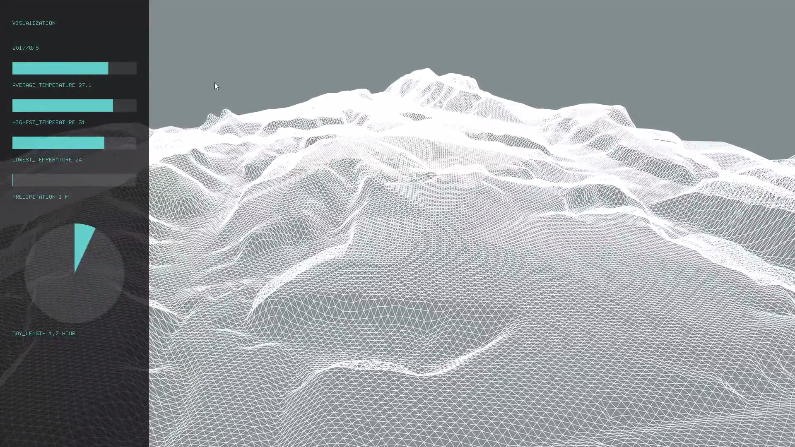

# Weather-Elements-Visualization
Vizualize weather-elements with openframeworks

## Example
- 
- [Movie](https://youtu.be/XEgv4ZmSOA4)
## Requirement
- openframeworks
- Weather-Elements data
  - such as provided by [Japan Meteorological Agency](http://www.jma.go.jp/jma/index.html)
- Alutitude data
  - such as provided by [Geospatial Information Authority of Japan](http://www.gsi.go.jp/)

## Installation
Clone this repository below your openframeworks apps directory.

## Usage
1. Get Weather-Elements data and Altitude data
2. Put data under **bin/data**
3.  Build openframeworks project
